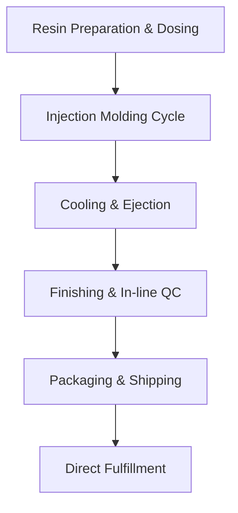

## Overview

Tawplast handles your plastic injection molding from initial resin selection through final shipment. You provide the design; we manage resin dosing, molding cycles, quality checks, and direct fulfillment. This ensures consistent, high-volume production with minimal lead times.

<Callout kind="info">
  Our process supports presses from `80-650t` and runs `24/7` for reliable output.
</Callout>

## Process Flow

Visualize the workflow from resin to delivery:



## Key Manufacturing Stages

Break down the core stages using these focused components:

<Columns cols={2}>
  <Card title="Resin Preparation" icon="package" href="#resin">
    Select and dose raw materials precisely for optimal melt flow and part quality.
  </Card>
  <Card title="Injection Molding" icon="settings" href="#molding">
    High-pressure injection into custom tools for precise replication.
  </Card>
  <Card title="Cooling & Ejection" icon="thermometer" href="#cooling">
    Controlled cooling ensures dimensional stability before automated ejection.
  </Card>
  <Card title="Quality Control" icon="shield" href="#qc">
    Real-time SPC and AQL sampling catch defects early.
  </Card>
</Columns>

## Step-by-Step Workflow

Follow these sequential steps for a typical production run:

<Steps>
  <Step title="Resin Preparation and Dosing" icon="package">
    Load virgin resin and additives into hoppers. Automated dosing ensures ratios like `100% PP` or `80/20 masterbatch blends`.

    <Expandable title="Advanced Blending" default-open="false">
      Use gravimetric feeders for `<0.1%` accuracy in colorants and stabilizers.
    </Expandable>
  </Step>
  <Step title="Injection Molding Cycle" icon="zap">
    Clamp tool, inject molten plastic at `200-300°C`, hold pressure, then transition to cooling.
  </Step>
  <Step title="Cooling, Ejection, and Finishing" icon="thermometer">
    Cool parts in mold for `10-60s` based on wall thickness. Eject via pins, then trim gates and inspect visually.
  </Step>
  <Step title="In-line Quality Control" icon="shield">
    Apply Statistical Process Control (`SPC`) for variables like weight and dimensions. Sample per AQL standards for attributes.

    ```javascript
    // Example SPC limits
    const specs = {
      weight: { min: 25.0, max: 25.5, tolerance: 0.02 },
      length: { target: 100, tolerance: 0.1 }
    };
    ```
  </Step>
  <Step title="Shipping and Fulfillment" icon="truck">
    Pack in custom boxes, label per your specs, and ship direct to your assembly lines or end customers.
  </Step>
</Steps>

## Quality Control Methods

Choose methods based on your volume and tolerance needs:

<Tabs>
  <Tab title="SPC (Variables)" icon="bar-chart">
    Monitor continuous data like part weight and dimensions.

    | Parameter   | Control Limits          |
    |-------------|-------------------------|
    | Weight      | `24.8g - 25.2g`        |
    | Dimensions  | `±0.05mm`               |
    | Cycle Time  | `<45s`                  |
  </Tab>
  <Tab title="AQL (Attributes)" icon="check-circle">
    Inspect for defects like flash or voids at levels `1.5` or `2.5`.

    Key defects:
    - Flash: `<0.2mm`
    - Voids: None visible
    - Color variation: ΔE `<1.0`
  </Tab>
</Tabs>

<Callout kind="tip">
  Integrate your specs via shared CAD files for seamless SPC setup.
</Callout>

## Best Practices

- Submit `STEP` or `IGES` files for tooling quotes.
- Specify resin grade and color upfront to avoid reformulation.
- Request in-line vision systems for high-cosmetic parts.

<Board title="Production Tracking">
  <BoardColumn title="Planning" color="0" icon="calendar">
    <BoardCard title="Resin Sourcing" description="Order 2T PP" dueDate="2024-12-01" />
  </BoardColumn>
  <BoardColumn title="In Progress" color="1" icon="loader-2">
    <BoardCard title="Tooling Fab" description="CNC milling" author="Tool Room" />
  </BoardColumn>
  <BoardColumn title="QC Hold" color="3" icon="alert-triangle">
    <BoardCard title="Dimensional Check" />
  </BoardColumn>
  <BoardColumn title="Shipped" color="2" icon="truck">
    <BoardCard title="1st Batch" description="10k units" createdAt="2024-12-10" />
  </BoardColumn>
</Board>